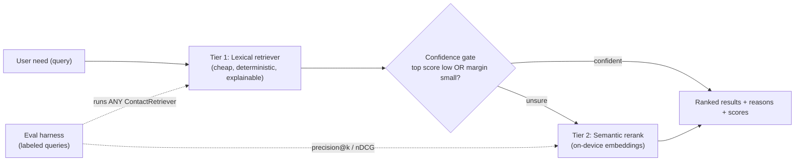

# Contact Lens

Contact Lens is a local-first business card and relationship search app,
implemented as a Flutter codebase for mobile and a Flutter Web demo. Its
"assistant" is a **tiered, cost-aware retrieval engine**: a cheap deterministic
lexical tier answers most queries in sub-millisecond time, and a semantic rerank
tier fires *only when the cheap tier is unsure* — semantic quality at a fraction
of always-on model cost. The choice of tier is not a guess; it is **measured**
against a labeled eval set (precision@k, nDCG@5). Running fully on-device is a
deliberate consequence of this design, not its headline.

On top of retrieval, Contact Lens records the **context of each exchange** —
time, place, and a quick note summarized into structured tags — and lets you
search across **time + place + meaning** in natural language (e.g.
「上個月在舊金山見面、做機器學習那個工程師叫什麼？」). See §4.

See [`docs/RETRIEVAL.md`](docs/RETRIEVAL.md) for the tier-by-tier cost/quality
tradeoff, [`docs/EVALUATION.md`](docs/EVALUATION.md) for the measurement
methodology, [`docs/SDD_retrieval_v2.md`](docs/SDD_retrieval_v2.md) for the
retrieval system design, and
[`docs/SSD-context-capture-and-semantic-retrieval.md`](docs/SSD-context-capture-and-semantic-retrieval.md)
for the context-capture and contextual-retrieval design.

## 1. Project Overview

The original Bizcard project already had useful ideas: business card scanning,
contact grouping, local contact fallback, and a first pass at contact retrieval.
This rewrite keeps those product ideas but rebuilds the project around one
engineering thesis:

> **Retrieval quality is a cost/latency tradeoff you should measure and tier,
> not a single algorithm you pick once.**

Most "AI search" features pay full model cost on every query. Contact Lens
instead spends compute where it changes the answer. A cheap lexical tier handles
the easy, high-overlap queries; a confidence gate detects the hard cases (low top
score, or a near-tie between the top candidates) and escalates *only those* to a
semantic rerank tier. The result is **semantic-grade quality on the queries that
need it, at close to lexical cost on the queries that don't** — and a scorecard
that proves hybrid ≥ lexical on nDCG@5 rather than asserting it.

The product boundary is intentionally narrow:

- Capture or paste business card OCR text.
- Parse contact fields with local rules.
- Store contacts locally for demo use.
- **Capture the context of an exchange**: auto-attach time + GPS place and a
  quick voice/text note, summarized into structured tags (on-device by default).
- Search contacts and groups.
- Run **tiered, cost-aware retrieval** for business matchmaking.
- **Ask across time, place, and meaning** in natural language — e.g.
  「上個月在舊金山見面、做機器學習那個工程師叫什麼？」.
- Explain why a contact matched, including which tier did the work, without
  inventing facts.

### Cost / latency / quality by tier

| Tier | Cost / query | Latency | Quality | When it runs |
|---|---|---|---|---|
| Lexical (Tier 1) | ~0 (pure Dart) | sub-ms | good on keyword overlap | always |
| Semantic rerank (Tier 2) | small (on-device embeddings) | low (local, no network) | strong on intent / synonyms | only when the lexical tier is unsure |
| Cloud LLM (stretch) | $$ per call | network round-trip | best | escalation only, behind the same interface |

The first two tiers are what the demo ships; the third documents the upgrade path
without forcing a dependency. Every tier implements one `ContactRetriever`
interface, so the eval harness and UI never care which strategy ran.

The Web build is a project demo. The mobile build is the primary app surface.

## 2. Architecture

Contacts are captured, projected into small search documents, then served by the
tiered retriever. The confidence gate is the heart of the cost story: it keeps
Tier 2 idle until Tier 1 is genuinely unsure.



The capture/parse/store/manifest pipeline that feeds this retriever is detailed
in [`docs/ARCHITECTURE.md`](docs/ARCHITECTURE.md) and
[`docs/RAG_PIPELINE.md`](docs/RAG_PIPELINE.md).

## 3. Tiered RAG Design

Each contact becomes a small search document:

- `name`
- `company`
- `jobTitle`
- `groups`
- `other` notes
- `place`, `tags`, `encounterNotes` — derived from the contact's **encounters**
  (see §4), so where and why you met someone is searchable too.

**Tier 1 — lexical (always on).** The lexical retriever tokenizes the user need
(Latin + CJK), scores weighted field matches, applies a phrase boost, and returns
the top contacts with their matched fields and reasons. It is pure Dart, costs
effectively nothing, and is fully explainable.

Default field weights:

| Field | Weight |
|---|---:|
| `name` | 5 |
| `company` | 3 |
| `jobTitle` | 3 |
| `place` | 3 |
| `tags` | 3 |
| `groups` | 2 |
| `other` | 1 |
| `encounterNotes` | 1 |

**Confidence gate.** Tier 1 also reports *how sure* it is. If the top score is
low, or the margin between the top two candidates is small, the query is flagged
as a hard case — exactly the queries where keyword overlap fails but intent or
synonyms would still find the right person.

**Tier 2 — semantic rerank (only when unsure).** For flagged queries, an
on-device embedding model re-scores the candidate pool by cosine similarity to
the query and blends that with the lexical score. No network call, no paid API —
just compute spent where it changes the ranking.

Every tier — lexical, semantic, and the hybrid that combines them — implements
the same `ContactRetriever` interface, so the eval harness can score any of them
and the UI can swap strategies without changes. See
[`docs/RETRIEVAL.md`](docs/RETRIEVAL.md) for when each tier earns its cost.

The assistant never creates new facts. If no contact has enough local evidence,
it returns suggestions such as adding more groups, industries, job titles, or
notes.

## 4. Encounter capture & contextual retrieval

Two capabilities turn a static address book into a memory of *when, where, and
why* you met someone.

**Automated context capture.** When a card is exchanged — scanned or added by
hand — Contact Lens attaches an **encounter** to the contact: the **time**, the
**GPS place** (sampled once, with consent; never tracked continuously), and a
quick **note** typed or dictated. The note is condensed into a one-line summary
and **structured tags**. Each contact keeps a timeline of encounters
(time · place · tags · summary). Sensors degrade gracefully: where location or
voice capture is unavailable (web/desktop, or a denied permission) the flow
proceeds without them rather than blocking.

**Time + place + meaning retrieval.** The Assistant answers natural-language
questions that mix *when*, *where*, and *what* — for example:

> 上個月在舊金山見面、做機器學習那個工程師叫什麼？
> ("Who was the ML engineer I met last month in San Francisco?")

The question is parsed into structured constraints — a UTC **time range**, a
**place**, and the residual **meaning** — encounters are filtered by those
constraints, and the surviving contacts are ranked by the same tiered
`ContactRetriever`. The parsed 時間 / 地點 / 語意 constraints render as chips above
the results, and the retriever explains how it filtered and ranked. When a
constraint matches nobody (a likely mis-parse), it falls back to searching the
full corpus rather than returning nothing — it never invents a match.

Because encounter place, tags, and notes are folded into each contact's search
document (§3), they are searchable by both the lexical and semantic tiers, and a
change to any encounter rebuilds the local index via the content hash.

**Generative enrichment is opt-in.** Note summarization and query parsing run
on-device by default through a deterministic heuristic adapter, so the
"No model API is called" guarantee holds out of the box and in the headless demo.
An optional Claude path (`claude-opus-4-8`, via the Messages API with structured
JSON output) is used **only when an API key is configured *and* the user toggles
cloud enrichment on** — with a one-line egress disclosure in the UI, and a
transparent fallback to the heuristic if a call fails. Retrieval itself is always
local. See
[`docs/SSD-context-capture-and-semantic-retrieval.md`](docs/SSD-context-capture-and-semantic-retrieval.md)
for the full design and the frozen interface contracts.

## 5. Reproducibility

Contact Lens keeps a RAG manifest concept similar to `personal-rag`:

- `cleaningVersion`
- `tokenizerVersion`
- `weightsVersion`
- `projectionVersion`
- per-contact content hash (including its encounters)

If a contact changes or the pipeline fingerprint changes, the local index is
considered stale and rebuilt.

## 6. Quick Start

```bash
flutter pub get
flutter run -d chrome
```

For mobile:

```bash
flutter run -d ios
flutter run -d android
```

### Headless demo (no device required)

The core retrieval, parser, and contextual layers are pure Dart, so they can be
exercised from a terminal without an emulator or browser:

```bash
flutter pub get
dart run tool/demo.dart
```

This runs the deterministic RAG over the sample contacts, summarizes a note into
tags, answers the flagship time + place + meaning query (English and Traditional
Chinese), and parses a sample business card. Pass your own query to override the
retrieval defaults:

```bash
dart run tool/demo.dart "Find a Taiwan finance contact"
```

### Free-form semantic queries (optional embedding service)

The Assistant's curated queries are answered from baked offline vectors with no
extra process. To get **real semantics on arbitrary typed queries** (e.g. a
Chinese phrase that shares no tokens with an English contact), run the local
embedding service — the app embeds the query at request time and otherwise falls
back to the precomputed vectors and the lexical tier:

```bash
# one-time: create the venv and install fastembed
python -m venv tool/embed/.venv
tool/embed/.venv/Scripts/python -m pip install -r tool/embed/requirements.txt

# start the service (keep it running during the demo)
tool/embed/.venv/Scripts/python tool/embed/serve_embeddings.py   # 127.0.0.1:8077
```

After changing the sample contacts or the eval/demo queries, rebuild the baked
vectors so the semantic tier stays in sync:

```bash
dart run tool/embed/dump_texts.dart
tool/embed/.venv/Scripts/python tool/embed/build_embeddings.py   # writes the *.g.dart
```

The service is optional: without it the demo still runs, just without on-the-fly
semantics for queries outside the precomputed set. See [`tool/embed/`](tool/embed/).

### Optional cloud enrichment (off by default)

Note summarization and query parsing run on-device by default. To enable the
optional Claude path, provide a key at build/run time and toggle *Cloud
enrichment* on in the Assistant:

```bash
flutter run -d chrome --dart-define=ANTHROPIC_API_KEY=sk-ant-...
```

The toggle only appears when a key is configured and stays off until you turn it
on; the headless demo and the tests never call a model API.

If native platform folders need to be regenerated in a fresh Flutter
installation:

```bash
flutter create --platforms=android,ios,web .
```

Then keep the existing `lib/`, `test/`, `docs/`, and `pubspec.yaml` changes.

## 7. Validation

```bash
flutter analyze
flutter test
```

The tests cover:

- tokenizer behavior for English, numbers, and CJK queries
- weighted retrieval and no-match fallback
- manifest rebuild behavior (including when an encounter changes)
- the `Encounter` model and encounter-aware retrieval
- contextual (time + place + meaning) filtering and fallback
- the LLM adapter (heuristic parsing/tagging, the Claude path against a mock, and
  the fallback decorator)
- the capture services' graceful-degradation paths
- UI widgets (capture sheet, encounter timeline, contextual assistant chips)
- business card parser behavior for Taiwan and English cards
- local storage seeding and manifest persistence

### Retrieval scorecard

Beyond pass/fail tests, retrieval quality is measured against a labeled eval set:

```bash
dart run tool/eval.dart         # lexical baseline scorecard
dart run tool/eval_hybrid.dart  # three-way: lexical vs semantic vs hybrid
```

These print per-query and aggregate precision@k and nDCG@5. The semantic tier (a
real multilingual MiniLM, ONNX via fastembed, precomputed offline — see
[`tool/embed/`](tool/embed/)) lifts ranking quality on the hard cross-language
queries lexical scores 0 on. See [`docs/EVALUATION.md`](docs/EVALUATION.md) for
how to read the scorecard and [`docs/RETRIEVAL.md`](docs/RETRIEVAL.md) for the
tier design behind these numbers.

## 8. Privacy Boundary

This repo does not include API keys. **Retrieval runs fully on-device** and reads
only saved contact fields; the assistant never invents background beyond saved
contact data.

The only feature that can leave the device is **generative enrichment** (note
summarization and query parsing), and it is **opt-in and off by default**: it
calls Claude only when an `ANTHROPIC_API_KEY` is configured *and* the user enables
the cloud toggle, with an in-UI egress disclosure. Otherwise — and always in the
headless demo and tests — a deterministic on-device heuristic does the work and
no model API is called.

Time and GPS place are sampled **once per exchange, with consent**; there is no
continuous tracking. The Web demo stores data in browser-backed local storage
through Flutter plugins; mobile builds use local device storage for the demo.

Mobile OCR uses a local adapter path. Web OCR is intentionally not bundled in
v1; paste OCR text into the scan demo.

## 9. Limitations & honest scope

- This is a portfolio/demo implementation, not a production CRM backend.
- Flutter Web is a demo surface and does not promise full mobile parity. Live GPS
  and voice capture run on the mobile build; on web they degrade to the
  consent/permission-denied path (type the place/note instead).
- OCR accuracy depends on the platform OCR adapter and image quality.
- The semantic tier ships a real multilingual MiniLM (ONNX via fastembed),
  precomputed offline and optionally served at runtime for free-form queries. The
  generative LLM (note summarization + query parsing) ships a deterministic
  on-device heuristic by default, with an opt-in Claude path behind the same
  `LlmAdapter` interface — see §4.
- The eval set is small and hand-labeled to make the tradeoff legible, not to
  claim production-scale benchmark numbers. The methodology, not the absolute
  score, is the deliverable — see [`docs/EVALUATION.md`](docs/EVALUATION.md).
- No cloud sync, login, or shared team workspace is included in v1.

## 10. Representative Queries

Business matchmaking (meaning):

- `Find someone who can help with AI product fundraising`
- `Need a Taiwan finance contact`
- `Who knows vector search and data privacy?`
- `Find a product designer for mobile onboarding`

Contextual (time + place + meaning):

- `上個月在舊金山見面、做機器學習那個工程師叫什麼？`
- `Who was the ML engineer I met last month in San Francisco?`
- `last month` / `San Francisco` — single constraints still filter encounters
