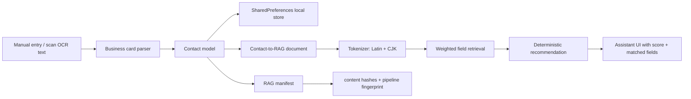

# Contact Lens

Contact Lens is a local-first business card and relationship search app. It is
implemented as a Flutter codebase for mobile and a Flutter Web demo. The app
does not call OpenAI, Gemini, or any paid model API. Its "assistant" is a
deterministic local RAG workflow over saved contact data.

## 1. Project Overview

The original Bizcard project already had useful ideas: business card scanning,
contact grouping, local contact fallback, and a first pass at contact retrieval.
This rewrite keeps those product ideas but rebuilds the project as a cleaner
Flutter app with explicit architecture, reproducible local indexing, tests, and
developer SOPs inspired by `personal-rag`.

The product boundary is intentionally narrow:

- Capture or paste business card OCR text.
- Parse contact fields with local rules.
- Store contacts locally for demo use.
- Search contacts and groups.
- Run local weighted retrieval for business matchmaking.
- Explain why a contact matched without inventing facts.

The Web build is a project demo. The mobile build is the primary app surface.

## 2. Architecture



## 3. Local RAG Design

Each contact becomes a small search document:

- `name`
- `company`
- `jobTitle`
- `groups`
- `other` notes

The retriever tokenizes the user need, scores field matches, applies a phrase
boost, then returns the top contacts with matched fields and reasons.

Default weights:

| Field | Weight |
|---|---:|
| `name` | 5 |
| `company` | 3 |
| `jobTitle` | 3 |
| `groups` | 2 |
| `other` | 1 |

The assistant never creates new facts. If no contact has enough local evidence,
it returns suggestions such as adding more groups, industries, job titles, or
notes.

## 4. Reproducibility

Contact Lens keeps a RAG manifest concept similar to `personal-rag`:

- `cleaningVersion`
- `tokenizerVersion`
- `weightsVersion`
- `projectionVersion`
- per-contact content hash

If a contact changes or the pipeline fingerprint changes, the local index is
considered stale and rebuilt.

## 5. Quick Start

```bash
flutter pub get
flutter run -d chrome
```

For mobile:

```bash
flutter run -d ios
flutter run -d android
```

If native platform folders need to be regenerated in a fresh Flutter
installation:

```bash
flutter create --platforms=android,ios,web .
```

Then keep the existing `lib/`, `test/`, `docs/`, and `pubspec.yaml` changes.

## 6. Validation

```bash
flutter analyze
flutter test
```

The tests cover:

- tokenizer behavior for English, numbers, and CJK queries
- weighted retrieval and no-match fallback
- manifest rebuild behavior
- business card parser behavior for Taiwan and English cards
- local storage seeding and manifest persistence

## 7. Privacy Boundary

This repo does not include API keys and does not call a remote model service.
The local assistant reads only saved contact fields. The Web demo stores data in
browser-backed local storage through Flutter plugins. Mobile builds use local
device storage for the demo.

Mobile OCR uses a local adapter path. Web OCR is intentionally not bundled in
v1; paste OCR text into the scan demo.

## 8. Limitations

- This is a portfolio/demo implementation, not a production CRM backend.
- Flutter Web is a demo surface and does not promise full mobile parity.
- OCR accuracy depends on the platform OCR adapter and image quality.
- Retrieval is deterministic lexical RAG, not semantic vector search.
- No cloud sync, login, or shared team workspace is included in v1.

## 9. Representative Queries

- `Find someone who can help with AI product fundraising`
- `Need a Taiwan finance contact`
- `Who knows vector search and data privacy?`
- `Find a product designer for mobile onboarding`

