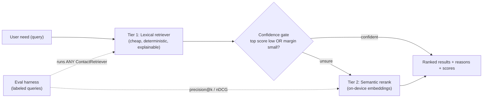

# Contact Lens

Contact Lens is a local-first business card and relationship search app,
implemented as a Flutter codebase for mobile and a Flutter Web demo. Its
"assistant" is a **tiered, cost-aware retrieval engine**: a cheap deterministic
lexical tier answers most queries in sub-millisecond time, and a semantic rerank
tier fires *only when the cheap tier is unsure* — semantic quality at a fraction
of always-on model cost. The choice of tier is not a guess; it is **measured**
against a labeled eval set (precision@k, nDCG@5). Running fully on-device is a
deliberate consequence of this design, not its headline.

See [`docs/RETRIEVAL.md`](docs/RETRIEVAL.md) for the tier-by-tier cost/quality
tradeoff, [`docs/EVALUATION.md`](docs/EVALUATION.md) for the measurement
methodology, and [`docs/SDD_retrieval_v2.md`](docs/SDD_retrieval_v2.md) for the
full system design.

## 1. Project Overview

The original Bizcard project already had useful ideas: business card scanning,
contact grouping, local contact fallback, and a first pass at contact retrieval.
This rewrite keeps those product ideas but rebuilds the project around one
engineering thesis:

> **Retrieval quality is a cost/latency tradeoff you should measure and tier,
> not a single algorithm you pick once.**

Most "AI search" features pay full model cost on every query. Contact Lens
instead spends compute where it changes the answer. A cheap lexical tier handles
the easy, high-overlap queries; a confidence gate detects the hard cases (low top
score, or a near-tie between the top candidates) and escalates *only those* to a
semantic rerank tier. The result is **semantic-grade quality on the queries that
need it, at close to lexical cost on the queries that don't** — and a scorecard
that proves hybrid ≥ lexical on nDCG@5 rather than asserting it.

The product boundary is intentionally narrow:

- Capture or paste business card OCR text.
- Parse contact fields with local rules.
- Store contacts locally for demo use.
- Search contacts and groups.
- Run **tiered, cost-aware retrieval** for business matchmaking.
- Explain why a contact matched, including which tier did the work, without
  inventing facts.

### Cost / latency / quality by tier

| Tier | Cost / query | Latency | Quality | When it runs |
|---|---|---|---|---|
| Lexical (Tier 1) | ~0 (pure Dart) | sub-ms | good on keyword overlap | always |
| Semantic rerank (Tier 2) | small (on-device embeddings) | low (local, no network) | strong on intent / synonyms | only when the lexical tier is unsure |
| Cloud LLM (stretch) | $$ per call | network round-trip | best | escalation only, behind the same interface |

The first two tiers are what the demo ships; the third documents the upgrade path
without forcing a dependency. Every tier implements one `ContactRetriever`
interface, so the eval harness and UI never care which strategy ran.

The Web build is a project demo. The mobile build is the primary app surface.

## 2. Architecture

Contacts are captured, projected into small search documents, then served by the
tiered retriever. The confidence gate is the heart of the cost story: it keeps
Tier 2 idle until Tier 1 is genuinely unsure.



The capture/parse/store/manifest pipeline that feeds this retriever is detailed
in [`docs/ARCHITECTURE.md`](docs/ARCHITECTURE.md) and
[`docs/RAG_PIPELINE.md`](docs/RAG_PIPELINE.md).

## 3. Tiered RAG Design

Each contact becomes a small search document:

- `name`
- `company`
- `jobTitle`
- `groups`
- `other` notes

**Tier 1 — lexical (always on).** The lexical retriever tokenizes the user need
(Latin + CJK), scores weighted field matches, applies a phrase boost, and returns
the top contacts with their matched fields and reasons. It is pure Dart, costs
effectively nothing, and is fully explainable.

Default field weights:

| Field | Weight |
|---|---:|
| `name` | 5 |
| `company` | 3 |
| `jobTitle` | 3 |
| `groups` | 2 |
| `other` | 1 |

**Confidence gate.** Tier 1 also reports *how sure* it is. If the top score is
low, or the margin between the top two candidates is small, the query is flagged
as a hard case — exactly the queries where keyword overlap fails but intent or
synonyms would still find the right person.

**Tier 2 — semantic rerank (only when unsure).** For flagged queries, an
on-device embedding model re-scores the candidate pool by cosine similarity to
the query and blends that with the lexical score. No network call, no paid API —
just compute spent where it changes the ranking.

Every tier — lexical, semantic, and the hybrid that combines them — implements
the same `ContactRetriever` interface, so the eval harness can score any of them
and the UI can swap strategies without changes. See
[`docs/RETRIEVAL.md`](docs/RETRIEVAL.md) for when each tier earns its cost.

The assistant never creates new facts. If no contact has enough local evidence,
it returns suggestions such as adding more groups, industries, job titles, or
notes.

## 4. Reproducibility

Contact Lens keeps a RAG manifest concept similar to `personal-rag`:

- `cleaningVersion`
- `tokenizerVersion`
- `weightsVersion`
- `projectionVersion`
- per-contact content hash

If a contact changes or the pipeline fingerprint changes, the local index is
considered stale and rebuilt.

## 5. Quick Start

```bash
flutter pub get
flutter run -d chrome
```

For mobile:

```bash
flutter run -d ios
flutter run -d android
```

### Headless demo (no device required)

The core retrieval and parser layers are pure Dart, so they can be exercised
from a terminal without an emulator or browser:

```bash
flutter pub get
dart run tool/demo.dart
```

This runs the deterministic RAG over the sample contacts and parses a sample
business card. Pass your own query to override the defaults:

```bash
dart run tool/demo.dart "Find a Taiwan finance contact"
```

If native platform folders need to be regenerated in a fresh Flutter
installation:

```bash
flutter create --platforms=android,ios,web .
```

Then keep the existing `lib/`, `test/`, `docs/`, and `pubspec.yaml` changes.

## 6. Validation

```bash
flutter analyze
flutter test
```

The tests cover:

- tokenizer behavior for English, numbers, and CJK queries
- weighted retrieval and no-match fallback
- manifest rebuild behavior
- business card parser behavior for Taiwan and English cards
- local storage seeding and manifest persistence

### Retrieval scorecard

Beyond pass/fail tests, retrieval quality is measured against a labeled eval set:

```bash
dart run tool/eval.dart         # lexical baseline scorecard
dart run tool/eval_hybrid.dart  # three-way: lexical vs semantic vs hybrid
```

These print per-query and aggregate precision@k and nDCG@5. On the current
labeled set the semantic tier (a real multilingual MiniLM, ONNX, precomputed
offline — see [`tool/embed/`](tool/embed/)) lifts ranking quality on the hard
cross-language queries lexical scores 0 on:

```
nDCG@5  lexical 0.687  →  hybrid 0.854   (Δ +0.167)
```

See [`docs/EVALUATION.md`](docs/EVALUATION.md) for how to read the scorecard and
[`docs/RETRIEVAL.md`](docs/RETRIEVAL.md) for the tier design behind these numbers.

## 7. Privacy Boundary

This repo does not include API keys and does not call a remote model service.
The local assistant reads only saved contact fields. The Web demo stores data in
browser-backed local storage through Flutter plugins. Mobile builds use local
device storage for the demo.

Mobile OCR uses a local adapter path. Web OCR is intentionally not bundled in
v1; paste OCR text into the scan demo.

## 8. Limitations & honest scope

- This is a portfolio/demo implementation, not a production CRM backend.
- Flutter Web is a demo surface and does not promise full mobile parity.
- OCR accuracy depends on the platform OCR adapter and image quality.
- The semantic tier ships with an on-device hashing embedding model so the demo
  stays dependency-free and offline. A learned model (e.g. ONNX MiniLM) behind
  the same `EmbeddingModel` interface, and a true cloud LLM escalation tier, are
  documented upgrade paths rather than shipped defaults — see
  [`docs/RETRIEVAL.md`](docs/RETRIEVAL.md).
- The eval set is small and hand-labeled to make the tradeoff legible, not to
  claim production-scale benchmark numbers. The methodology, not the absolute
  score, is the deliverable — see [`docs/EVALUATION.md`](docs/EVALUATION.md).
- No cloud sync, login, or shared team workspace is included in v1.

## 9. Representative Queries

- `Find someone who can help with AI product fundraising`
- `Need a Taiwan finance contact`
- `Who knows vector search and data privacy?`
- `Find a product designer for mobile onboarding`

