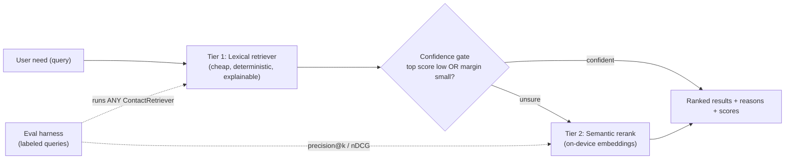

# Architecture

Contact Lens is organized by responsibility rather than by screen first. The
retrieval layer is **tiered and cost-aware**: a cheap lexical tier serves every
query, and a confidence gate escalates only the hard ones to a semantic rerank
tier. This document covers the system layout and the cost/latency model; for the
per-tier quality tradeoff see [`RETRIEVAL.md`](RETRIEVAL.md), and for how the
tradeoff is measured see [`EVALUATION.md`](EVALUATION.md).

## Layers

- `lib/domain`: immutable-ish data models for contacts, groups, RAG documents,
  and manifests.
- `lib/data`: sample data, local storage, ID generation, and repository
  contracts.
- `lib/rag`: the retrieval tiers behind one `ContactRetriever` interface —
  tokenizer and document projection, the lexical `WeightedContactRetriever`
  (Tier 1), the semantic rerank tier (Tier 2), and the `HybridContactRetriever`
  that gates between them.
- `lib/eval`: pure metric functions (precision@k, nDCG@k), the labeled eval
  dataset, and the `runEval` harness that scores *any* `ContactRetriever`.
- `lib/scan`: OCR adapter boundary and business card parser.
- `lib/ui`: app state and Flutter screens.
- `test`: unit tests for parser, RAG, metrics, manifest, and storage.

## Retrieval pipeline

The retriever is the part that earns the "AI/ML" framing, so it is drawn
explicitly. The confidence gate is what keeps Tier 2 idle until it is needed.

Because every tier implements the same `ContactRetriever` interface, the eval
harness and the UI are blind to which strategy ran — the gate, the reranker, and
even a future cloud tier are swappable without touching callers.

## Data Flow

1. A user manually adds a contact or parses OCR text.
2. The contact is saved in local storage.
3. The manifest records content hashes and pipeline fingerprint.
4. Assistant queries are tokenized locally.
5. Tier 1 ranks contacts with weighted lexical retrieval and reports confidence.
6. The confidence gate escalates only unsure queries to the Tier 2 semantic
   rerank; confident queries skip it entirely.
7. The UI renders matched fields, score, the deterministic reasons, and which
   tier produced the ranking.

## Cost & latency model

The whole point of tiering is that average cost tracks the *easy* queries, not
the hard ones. Let `p` be the fraction of queries the gate escalates to Tier 2.

| Quantity | Tier 1 (lexical) | Tier 2 (semantic rerank) |
|---|---|---|
| Marginal cost / query | ~0 — pure Dart, in-memory scan | small — embed query + cosine over a *candidate pool*, not the full corpus |
| Latency | sub-millisecond | low; on-device, no network round-trip |
| External dependency | none | none (default hashing embedding model) |
| Fires on | every query | only the `p` fraction the gate flags |

So the **expected cost per query is `cost_lexical + p · cost_rerank`**. Two design
choices keep `p · cost_rerank` small:

- **The gate keeps `p` low.** Only queries with a low top score or a small
  top1–top2 margin escalate. Confident keyword matches never pay the rerank cost.
- **Tier 2 reranks a candidate pool, not the corpus.** Embeddings are computed
  over the handful of candidates Tier 1 already surfaced (and contact embeddings
  are cached against the RAG-manifest fingerprint), so cost grows with `k`, not
  with the number of stored contacts.

This is the difference between *cost-avoidance* ("we skipped ML to be cheap") and
*cost-engineering* ("we measured where ML changes the answer and spend only
there"). The escalation point is documented, not hand-wavy: a future cloud LLM
tier would sit behind the same gate with a higher threshold, paying network cost
only for the residual queries the on-device rerank still can't resolve.

## Platform Notes

- Mobile is the primary app target.
- Flutter Web is a demo target for recruiters and reviewers.
- Web does not bundle production OCR in v1.
- The default build runs every tier on-device with no paid AI/model API. That
  privacy/offline property is a consequence of the cost design, not a constraint
  imposed on it.

