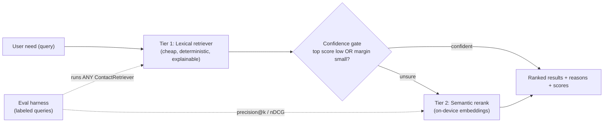

# SDD — Retrieval v2: Measured, Cost-Aware, Tiered Contact Retrieval

Status: approved for parallel build
Owner: lead (Phase 0) → 3 parallel workstreams (A / B / C)
Target: ready before the demo

## 1. Motivation

Contact Lens currently ships a single lexical scorer marketed as "no model
API, deterministic, private." For an AI/ML R&D audience that framing reads as
*cost-avoidance* ("we skipped ML") rather than *cost-engineering* ("we made a
measured tradeoff"). This SDD upgrades the system to:

1. **Measure** retrieval quality (precision@k, nDCG) with a labeled eval set.
2. **Reframe** the story as a tiered, cost-aware architecture.
3. **Implement** a semantic rerank tier that fires only when the cheap lexical
   tier is unsure — semantic quality at a fraction of always-on LLM cost.

The money result: an eval scorecard showing **hybrid ≥ lexical on nDCG@5**,
plus a narrative that demonstrates judgment + measurement, not just an app.

## 2. Target architecture



Both tiers implement one interface, so the eval harness and UI never care which
strategy runs.

## 3. Phase 0 — Shared foundation (DONE; merged to main before A/B/C start)

This is the decoupling layer that lets three agents work without collisions.

- `lib/rag/contact_retriever.dart` — `abstract class ContactRetriever` with
  `List<RetrievedContact> retrieve(String userNeed, List<Contact> contacts, {int k})`.
- `WeightedContactRetriever implements ContactRetriever` (lexical tier).
- Exported from `lib/rag/rag.dart`.

**Frozen contracts (do NOT change; code against these):**

```dart
// Retrieval (Phase 0, already on main)
abstract class ContactRetriever {
  List<RetrievedContact> retrieve(String userNeed, List<Contact> contacts, {int k});
}

// Evaluation (Workstream A authors; B & C code against these names)
class EvalCase {
  final String query;
  final Map<String, double> relevance; // contactId -> graded gain (e.g. 3,2,1; 0 = irrelevant)
}
class EvalReport {
  final Map<int, double> meanPrecisionAtK; // k -> mean precision@k
  final Map<int, double> meanNdcgAtK;      // k -> mean nDCG@k
  // + per-case rows for the printed scorecard
}
EvalReport runEval(ContactRetriever retriever, List<EvalCase> cases,
    {List<int> ks = const [1, 3, 5]});

// Hybrid (Workstream C authors)
class HybridContactRetriever implements ContactRetriever {
  const HybridContactRetriever({ /* lexical + reranker + gate thresholds */ });
}
```

Metric definitions (authoritative — A implements, B documents):
- `precision@k = |{ i < k : relevance[rankedIds[i]] > 0 }| / k`
- `DCG@k = Σ_{i=0}^{k-1} gain_i / log2(i + 2)` where `gain_i = relevance[rankedIds[i]] ?? 0`
- `IDCG@k = DCG@k of the ideal ordering (gains sorted desc)`
- `nDCG@k = DCG@k / IDCG@k` (0 when IDCG@k == 0)

## 4. Workstreams

### Workstream A (🔴) — Evaluation harness  [highest ROI, ~half day, no new deps]

**Goal:** turn the demo from "an app" into "I measure retrieval quality."

Files (A is sole owner):
- `lib/eval/metrics.dart` — pure functions `precisionAtK`, `ndcgAtK`, `recallAtK`.
- `lib/eval/eval_dataset.dart` — labeled `List<EvalCase>` over `sampleContacts`
  (reference sample contact ids: `sample-alex-chen`, `sample-mia-lin`,
  `sample-jordan-lee`, `sample-wu-kuei-hua`, `sample-priya-shah`). ≥ 8 queries,
  mix EN/ZH, include a deliberate no-match case.
- `lib/eval/eval_runner.dart` — defines `EvalCase`, `EvalReport`, `runEval(...)`
  per §3. `runEval` ranks each query, computes per-k metrics, aggregates.
- `tool/eval.dart` — CLI `dart run tool/eval.dart`: runs `runEval` against
  `WeightedContactRetriever`, prints a per-query + aggregate scorecard, exits
  non-zero if `meanNdcgAtK[5]` < a documented floor (so CI can gate).
- `test/eval/metrics_test.dart` — metric math on known inputs → known outputs.

Dependencies: Phase 0 only. **Must NOT** touch README, pubspec, UI, or
`lib/rag/*`. Hand B a 4–6 line "how to read the scorecard" snippet via the PR
description (not by editing docs).

Acceptance: `flutter analyze` clean; metric tests pass; `dart run tool/eval.dart`
prints precision@1/@3 + nDCG@5 (aggregate + per query).

### Workstream B (🟡) — Narrative + architecture/upgrade-path  [docs only, ~half day]

**Goal:** replace "no API" positioning with "tiered, cost-aware, measured."

Files (B is sole owner — A and C must not touch these):
- `README.md` — rewrite §1/§3/§8: lead with the tiered cost-aware story; add a
  **cost/latency/quality tier table**; link to eval + this SDD. Keep the privacy
  point but subordinate it to the tradeoff narrative.
- `docs/ARCHITECTURE.md` — replace the mermaid with the §2 tiered diagram; add a
  "Cost & latency model" section.
- `docs/RETRIEVAL.md` (new) — lexical baseline vs semantic rerank vs hybrid
  gate; *when each tier is worth its cost*; the quantitative tradeoff narrative.
- `docs/EVALUATION.md` (new) — how to run `tool/eval.dart`, what precision@k and
  nDCG mean, how to read the scorecard (use A's snippet + §3 metric defs).
- `docs/DEMO_SCRIPT.md` (new) — 60-second interview talk track: CLI eval → UI →
  cost story. (Optional but high-signal.)
- `lib/ui/screens/architecture_screen.dart` — update on-screen copy/diagram to
  match the tiered design (B owns this one screen only).

Dependencies: none on A/C code — write against the frozen §3 contracts and
metric names. This is why B can start immediately.

Tier table to fill in (template):

| Tier | Cost / query | Latency | Quality | When it runs |
|---|---|---|---|---|
| Lexical | ~0 | sub-ms | good on keyword overlap | always |
| Semantic rerank | small (local embed) | low | strong on intent/synonyms | only when lexical is unsure |
| (Stretch) cloud LLM | $$ per call | network | best | escalation only |

Acceptance: README reframed; new docs render; mermaid valid; no code conflicts.

### Workstream C (🟢) — Hybrid semantic rerank  [~1 day, pubspec owner]

**Goal:** make "I avoided ML" become "I built both and let data pick."

Files (C is sole owner):
- `lib/rag/semantic/embedding_model.dart` — `abstract class EmbeddingModel { List<double> embed(String text); }` plus
  `HashingEmbeddingModel` (deterministic char/word n-gram → fixed-dim L2-normalized
  vector; **no external deps**, runs offline, testable). This is the default so
  the demo never needs a model download.
- `lib/rag/semantic/vector_ops.dart` — `cosineSimilarity`, normalization.
- `lib/rag/semantic/semantic_reranker.dart` — re-scores a candidate list by
  cosine(query, contact-doc) and blends with the lexical score.
- `lib/rag/hybrid_retriever.dart` — `HybridContactRetriever implements ContactRetriever`:
  Tier-1 = `WeightedContactRetriever` to get a candidate pool, **confidence gate**
  (run rerank only when `topScore < T` or `top1 - top2 < margin`), blend, return
  `RetrievedContact` whose `matchReason` notes the semantic contribution.
  Cache contact embeddings (reuse the existing RAG-manifest fingerprint concept).
- `tool/eval_hybrid.dart` — thin CLI: `runEval(const HybridContactRetriever(), ...)`
  (imports A's `lib/eval/eval_runner.dart` + dataset). **Soft dep on A** — this is
  C's last step; land it after A merges.
- `lib/ui/app_state.dart` + `lib/ui/screens/assistant_screen.dart` — add a
  "hybrid on/off" toggle and surface when semantic rerank fired (C owns these two).
- `pubspec.yaml` — **C is the ONLY workstream allowed to edit pubspec.** Default
  build adds no dependency; an ONNX MiniLM-backed `EmbeddingModel` behind the same
  interface is a *stretch* goal — gate it so the default path stays dep-free.
- Tests: `test/rag/hybrid_retriever_test.dart`, `test/rag/semantic/*_test.dart`.

Dependencies: Phase 0 (interface) + A's `runEval` (only for `tool/eval_hybrid.dart`,
done last). **Must NOT** touch README or `lib/eval/*` or `lib/rag/tokenizer.dart`.

Acceptance: `flutter analyze` clean; hybrid tests pass; `dart run tool/eval_hybrid.dart`
shows **nDCG@5(hybrid) ≥ nDCG@5(lexical)** on the labeled set; UI toggle works.

## 5. File-ownership matrix (no two workstreams share a writable file)

| Path | Owner |
|---|---|
| `lib/rag/contact_retriever.dart`, `rag.dart`, `retrieve_contacts.dart` | Phase 0 (frozen) |
| `lib/eval/**`, `tool/eval.dart`, `test/eval/**` | A |
| `README.md`, `docs/ARCHITECTURE.md`, `docs/RETRIEVAL.md`, `docs/EVALUATION.md`, `docs/DEMO_SCRIPT.md`, `lib/ui/screens/architecture_screen.dart` | B |
| `lib/rag/semantic/**`, `lib/rag/hybrid_retriever.dart`, `tool/eval_hybrid.dart`, `lib/ui/app_state.dart`, `lib/ui/screens/assistant_screen.dart`, `pubspec.yaml`, `test/rag/hybrid_retriever_test.dart`, `test/rag/semantic/**` | C |
| `docs/SDD_retrieval_v2.md` (this file) | read-only reference |

Anything not listed: do not edit; if you think you need to, stop and flag it.

## 6. Branch & merge protocol

1. Phase 0 is already on `main`.
2. Each agent works on its own branch/worktree off `main`:
   `feat/eval-harness` (A), `feat/retrieval-narrative` (B), `feat/hybrid-rerank` (C).
   Use isolated worktrees so working trees never overlap.
3. Micro-commit within each branch (one logical change per commit).
4. Merge order: **A → C → B** (C's eval entry needs A's `runEval`; B documents
   the merged reality). B may merge anytime since it owns docs-only paths.
5. Post-merge gate (run on `main`):
   `flutter analyze && flutter test && dart run tool/eval.dart && dart run tool/eval_hybrid.dart`
   — expect clean analyze, green tests, and hybrid nDCG@5 ≥ lexical.

## 7. Risks & mitigations

- **Parallel edits to README/pubspec/core** → eliminated by §5 ownership.
- **ONNX-in-Flutter friction** → default `HashingEmbeddingModel` (dep-free);
  ONNX is optional/stretch behind `EmbeddingModel`.
- **Circular gate tuning** → fix gate thresholds empirically via `tool/eval.dart`.
- **A↔C eval dependency** → C codes `tool/eval_hybrid.dart` against the frozen
  `runEval` signature and lands it last.

## 8. Definition of done (whole effort)

- `flutter analyze` clean, all tests green.
- `dart run tool/eval.dart` and `dart run tool/eval_hybrid.dart` print scorecards;
  hybrid improves nDCG@5 over lexical on the labeled set.
- README + docs tell the tiered, cost-aware, measured story.
- `docs/DEMO_SCRIPT.md` gives a runnable 60-second interview walkthrough.
